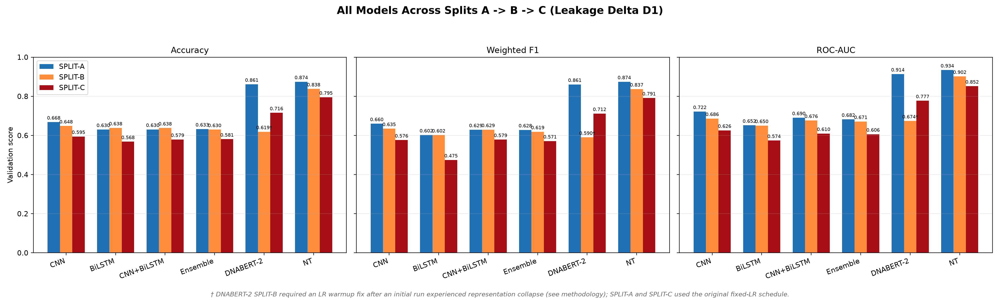
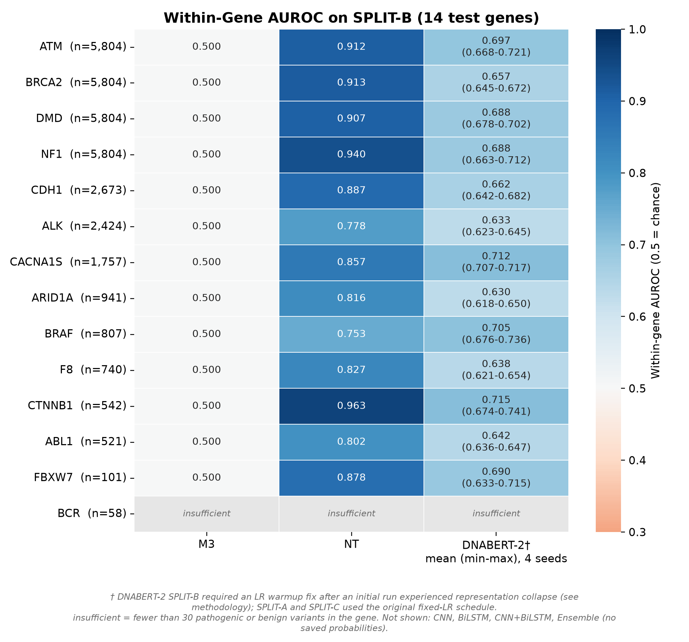

# Genetic Variant Pathogenicity Classification — Reproduction & Split Audit

**Author: Rishank Raj R**

A rigorous best-effort reproduction of the AICAPS 2026 paper *"Enhancing Genetic Variant Pathogenicity Classification using Mutation-Aware Transformer Architectures"* (DOI: `10.1109/AICAPS68631.2026.11452691`), extended with an original **split-audit study** that stress-tests every model under harder evaluation regimes — gene-disjoint and temporal splits — and systematically rules out candidate explanations for the performance drops.

> **TL;DR** — The paper's headline numbers reproduce on a random split (DNABERT-2: 0.914 AUROC, NT: 0.934). But under a **gene-disjoint** split, DNABERT-2 collapses to 0.674 while NT barely moves (0.902). A four-seed pre-registered analysis confirms this is a **stable effect, not seed luck**, and a battery of six diagnostics (M3, M4, D3–D7) rules out gene-identity priors, allele frequency, locus overlap, and sequence duplication as the cause — pinpointing **gene-specific sequence learning that fails to transfer to unseen genes**.

---

## 1. Problem

Given a DNA sequence window centered on a genetic variant (SNV or small indel), predict whether the variant is **pathogenic** or **benign** — a binary, sequence-level classification task sourced from ClinVar expert labels.

The paper claims pretrained genomic language models (DNABERT-2, Nucleotide Transformer) dramatically outperform classical sequence models on this task. This project asks two questions:

1. **Does the reproduction hold?** (Phase 1)
2. **What do the models actually learn — and does it generalize beyond the test distribution they were validated on?** (Phase 2, the split audit)

## 2. Why a split audit?

A random 80/20 split lets a model score well by exploiting **gene-family shortcuts**: variants from the same gene appear in both train and test, so memorizing gene-specific context is enough. Real-world deployment asks a harder question — *can you classify a variant in a gene you've never seen?* Three evaluation regimes probe this:

| Split | Definition | What it tests |
|---|---|---|
| **A — Random** | Stratified 80/20, seed 42 | The paper's setting (in-distribution) |
| **B — Gene-disjoint** | 86 train genes / 14 held-out genes, zero gene overlap | Gene-memorization dependence |
| **C — Temporal** | Train ≤ 2024-11-04, test after | Distribution shift / drift robustness |

## 3. Pipeline

```
                    ┌────────────────────────────────────────────────┐
                    │                 DATA PIPELINE                  │
                    │                                                │
 ClinVar VCF ─────► │ filter: SNVs + indels, 100 canonical genes     │
 (2025-06-30)       │ strand-aware windows via GENCODE v46           │
 GRCh38 + GENCODE   │ ref/mutant paired 100 bp sequences             │
                    │ per-gene cap 5,804 (label-ratio preserving)    │
                    └───────────────────┬────────────────────────────┘
                                        │  168,927 variants · 100 genes
                                        │  46.3% pathogenic / 53.7% benign
                 ┌──────────────────────┼──────────────────────┐
                 ▼                      ▼                      ▼
          ┌────────────┐        ┌────────────┐        ┌────────────┐
          │  SPLIT A   │        │  SPLIT B   │        │  SPLIT C   │
          │ random 80/20│       │ gene-disjoint│      │  temporal  │
          └─────┬──────┘        └─────┬──────┘        └─────┬──────┘
                │                     │                     │
                ▼                     ▼                     ▼
        ┌───────────────────────────────────────────────────────┐
        │                    MODELS (6)                         │
        │  classical: CNN · BiLSTM · CNN+BiLSTM · ensemble      │
        │  genomic transformers: DNABERT-2 (117M) · NT (100M)   │
        └───────────────────────────┬───────────────────────────┘
                                    │
                                    ▼
        ┌───────────────────────────────────────────────────────┐
        │              DIAGNOSTICS (the audit)                  │
        │  M3 gene-only baseline · M4 AF-only baseline          │
        │  D3 allele-frequency matched · D4 permutation null    │
        │  D5 per-gene decomposition · D6 cross-gene similarity │
        │  D7 locus-overlap test · 4-seed robustness queue      │
        └───────────────────────────────────────────────────────┘
```

**Stack:** Python 3.14 · PyTorch 2.14 · HuggingFace Transformers 4.57 · scikit-learn · pandas/pyarrow · trained on a single RTX 3050 (6 GB) — transformers via mixed precision + gradient checkpointing, one GPU job at a time.

## 4. Results

### 4.1 Phase 1 — Reproduction (SPLIT-A, 100 bp)

| Model | Accuracy | Weighted F1 | ROC-AUC | Pathogenic recall |
|---|---|---|---|---|
| CNN | 0.668 | 0.660 | 0.722 | 0.511 |
| BiLSTM | 0.630 | 0.602 | 0.652 | 0.356 |
| CNN+BiLSTM | 0.630 | 0.629 | 0.690 | 0.561 |
| Ensemble | 0.633 | 0.628 | 0.682 | 0.518 |
| **DNABERT-2** | **0.861** | **0.861** | **0.914** | **0.811** |
| **Nucleotide Transformer** | **0.874** | **0.874** | **0.934** | **0.845** |

The paper's qualitative claim reproduces: genomic transformers dominate classical sequence models by ~0.19–0.28 AUROC.

### 4.2 Phase 2 — The split audit (ROC-AUC by split)



| Model | A (random) | B (gene-disjoint) | C (temporal) | A→B drop |
|---|---|---|---|---|
| CNN | 0.722 | 0.686 | 0.626 | −0.036 |
| BiLSTM | 0.652 | 0.650 | 0.574 | −0.002 |
| CNN+BiLSTM | 0.690 | 0.676 | 0.610 | −0.014 |
| Ensemble | 0.682 | 0.671 | 0.606 | −0.011 |
| **DNABERT-2** | **0.914** | **0.674**† | **0.777** | **−0.240** |
| **NT** | **0.934** | **0.902** | **0.852** | **−0.033** |

† DNABERT-2 SPLIT-B required an LR-warmup fix (10% linear) after the fixed-LR run suffered representation collapse (AUROC 0.500, all-benign). SPLIT-A/C used the original schedule.

**The headline finding:** DNABERT-2 loses 0.24 AUROC when genes are held out; NT loses only 0.03. Classical models barely notice.

### 4.3 Is DNABERT-2's collapse seed luck? No — pre-registered 4-seed analysis

A stopping rule was committed to git (`ff55707`) *before* any seed runs. Four seeds (42/1/2/3, warmup 0.1):

| Seed | AUROC | Pathogenic recall |
|---|---|---|
| 42 | 0.6740 | 0.343 |
| 1 | 0.6796 | 0.612 |
| 2 | 0.6785 | 0.436 |
| 3 | 0.6640 | 0.479 |
| **mean** | **0.6740** | range 0.0156 |

Rule bucket: **STABLE EFFECT** (range ≤ 0.03, max < 0.75). The warmup-0 control collapsed on a *different* seed too (0.5001, all-benign) — warmup is genuinely required on this split. Training logs show final training loss 0.17–0.30: the model **fits its training genes but fails to transfer** to unseen ones.

### 4.4 What explains the drop? Six diagnostics, six eliminations

| Diagnostic | Question | Result |
|---|---|---|
| **M3** gene-only baseline | Is it a gene-identity label prior? | No — gene identity alone gets only 0.690 (A) / 0.500 (B, chance floor by construction) |
| **M4** AF-only baseline | Is it allele frequency? | No — AF-only reaches 0.576; AF-matched subsets don't close the gap (D3) |
| **D4** permutation null | Is M3 itself meaningful? | Real M3 is 7.7σ (A) / 4.6σ (C) above the gene-scramble null (p = 0.005) |
| **D5** per-gene decomposition | A few bad genes? | No — DNABERT-2 is uniformly weak (0.63–0.72 across all 13 valid genes); NT ≥ 0.75 in all 13, beats DNABERT-2 in 13/13 |
| **D6** cross-gene similarity | Duplicate sequences across genes? | No — zero exact/revcomp duplicates; max shared-25-mer fraction 0.342; zero test windows ≥ 0.5 |
| **D7** locus overlap | Same-locus variants? | Minor — explains only 6.3% of DNABERT-2's A→B drop (vs 35% of NT's much smaller drop) |



**Conclusion (hedged):** the evidence is *consistent with* DNABERT-2 learning gene-specific sequence context that does not transfer to unseen genes — while NT, trained multi-species at scale, transfers. The mechanism is behavioural, not interpretability-proven; single-seed caveats remain on A/C and NT (see [limitations](#7-limitations)).

### 4.5 Full metric set

All 24 experiment JSONs are in [`results/metrics/`](results/metrics/); every table in [`results/tables/`](results/tables/) (cross-split comparison, split-shift deltas, M3-vs-transformers, paper-vs-reproduction). Selected figures:

| Figure | What it shows |
|---|---|
| `results/figures/local_model_comparison.png` | All 6 models, SPLIT-A |
| `results/figures/cross_split_comparison_chart.png` | A/B/C AUROC, all models (above) |
| `results/figures/confusion_matrix_dnabert2*.png` | Per-model per-split confusion matrices (21 total) |
| `results/d5_per_gene/fig2_gene_auroc_splitA_vs_splitB.png` | Same genes, seen vs unseen |
| `results/figures/d4_permutation_null_m3.png` | Gene-scramble null distribution |

## 5. Repository layout

```
variant-pathogenicity-split-audit/
├── src/
│   ├── data/            # build_dataset (ClinVar→windows), build_splits, splits
│   ├── models/          # classical.py (CNN/BiLSTM/CNN+BiLSTM/ensemble)
│   ├── training/        # run_experiment, transformer_utils (DNABERT-2/NT)
│   ├── evaluation/      # compare_results, generate_results, split comparison
│   └── visualization/   # figures.py
├── scripts/             # experiment drivers: seed queue, M3/M4, D4-D7, figures
├── configs/             # per-experiment YAML configs
├── data/splits/         # frozen split manifests (hash-verified train/test IDs)
├── results/
│   ├── metrics/         # 24 JSONs — every model × split × seed
│   ├── tables/          # CSV/MD/PNG result tables
│   ├── figures/         # 29 publication-style figures
│   ├── reports/         # reproduction report, discrepancy report, paper spec
│   ├── m3_gene_only/    # gene-prior baseline + D4 permutation null
│   ├── d3_af_matched/   # allele-frequency matched evaluation
│   ├── d5_per_gene/     # per-gene decomposition
│   ├── d6_cross_gene_similarity/
│   ├── d7_locus_overlap/
│   └── handoff/         # full-precision export of every diagnostic
├── docs/                # terminology, seed stopping rule, Colab workflow
├── notebooks/           # transformer training on Colab (optional)
└── REPRODUCTION_MANIFEST.yaml   # every assumption, pinned & tagged
```

## 6. Reproducing

```bash
python -m venv .venv && source .venv/bin/activate
pip install -r requirements.txt

# 1. build the dataset (needs ClinVar VCF + GRCh38 FASTA + GENCODE GTF)
python -m src.data.build_dataset --window 100 --gene-cap 5804

# 2. train a model on a split
python -m src.training.run_experiment \
    --data data/processed/variants_100bp.parquet \
    --model dnabert2 --window 100 --split A

# transformers on a 6 GB GPU: use the local trainer with warmup on SPLIT-B
python scripts/train_transformer_local.py --model dnabert2 --split-manifest \
    data/splits/split_manifest_b.json --warmup-ratio 0.1

# 3. seed robustness (pre-registered stopping rule in docs/)
bash scripts/run_seed_queue.sh && python scripts/summarize_seeds.py

# 4. diagnostics
python scripts/run_m3_gene_only.py --splits A B C
python scripts/run_m3_permutation.py          # D4
# D3/D5/D6/D7 drivers in scripts/ — see results/handoff/*.md for outputs

# 5. tables + figures
python -m src.evaluation.compare_results
python -m src.visualization.figures
```

**Data note:** the dataset is rebuildable from public sources (ClinVar release `2025-06-30`, GRCh38, GENCODE v46 — exact URLs in the manifest), but the raw files are not redistributed here. `REPRODUCTION_MANIFEST.yaml` documents every reconstruction decision with confidence tags, because the paper provides no data-availability statement, gene list, or checkpoint IDs.

## 7. Limitations

- Warmup was applied only to DNABERT-2 SPLIT-B (the collapsed run); A/C used the paper's fixed LR — a recipe asymmetry, judged acceptable because the warmup-0 control also collapses
- SPLIT-A and SPLIT-C transformer results are single-seed; only SPLIT-B has the 4-seed treatment
- The exact author gene list is unavailable — a static 100-gene substitute (50 cancer + 50 Mendelian) is used, making dataset-identity fidelity LOW (documented in the manifest)
- D6 similarity analysis uses 25-mer shingles; diverged homology (paralogs) is not covered
- SPLIT-C uses ClinVar `LastEvaluated`, which conflates "genuinely new" with "recently reclassified" variants
- No attention/interpretability analysis — the transfer-failure mechanism is behavioural evidence only

Full honesty ledger: [`results/reports/reproduction_report.md`](results/reports/reproduction_report.md) (fidelity self-assessment: methodology MEDIUM, dataset identity LOW, overall PARTIAL), [`results/reports/discrepancy_report.md`](results/reports/discrepancy_report.md), [`docs/terminology.md`](docs/terminology.md).

## 8. Credits

**Rishank Raj R** — implementation, experiments, and analysis.

*Reproduction target:* Anjana M. P. & Arun K. S., "Enhancing Genetic Variant Pathogenicity Classification using Mutation-Aware Transformer Architectures," AICAPS 2026.
